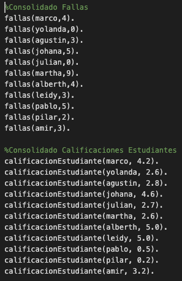
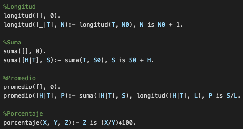
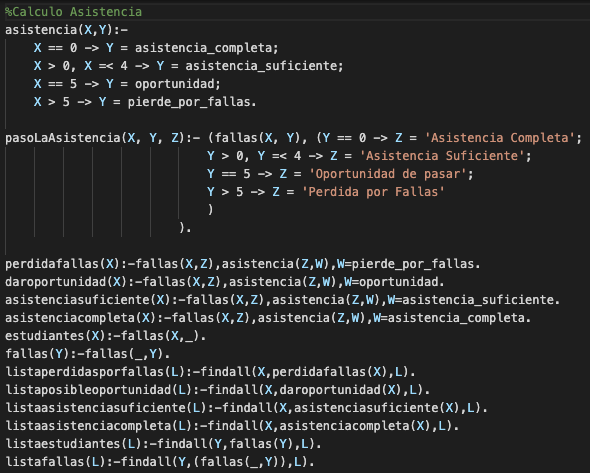
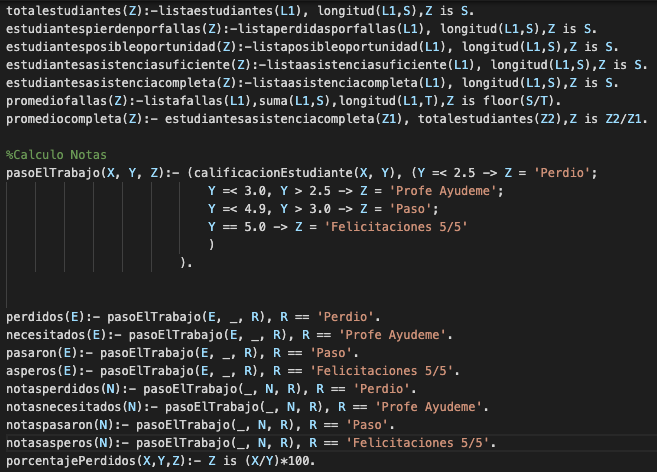
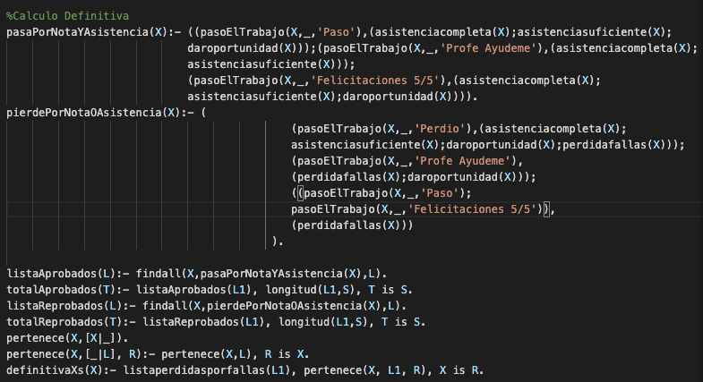
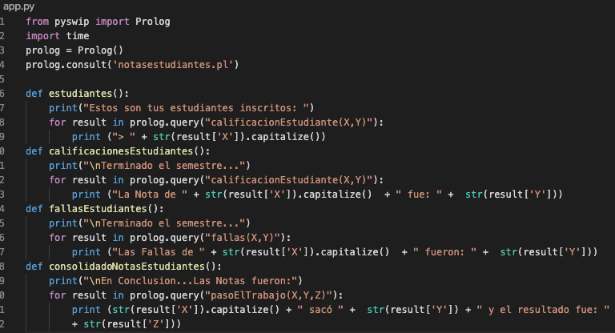
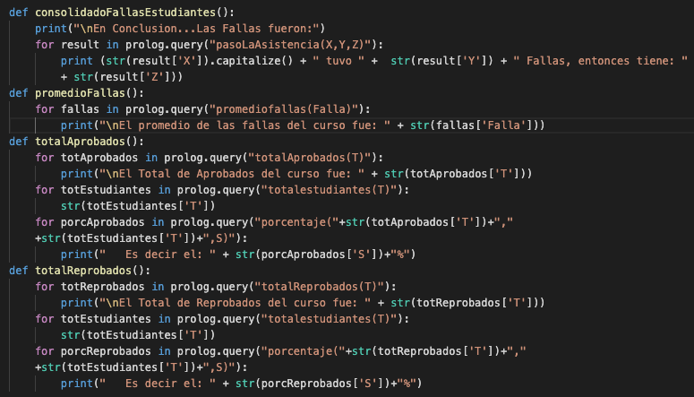
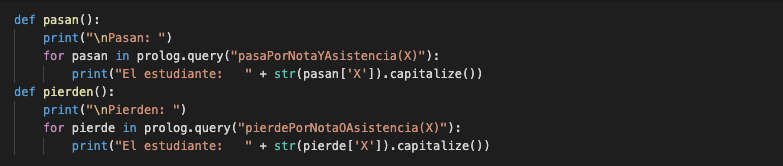
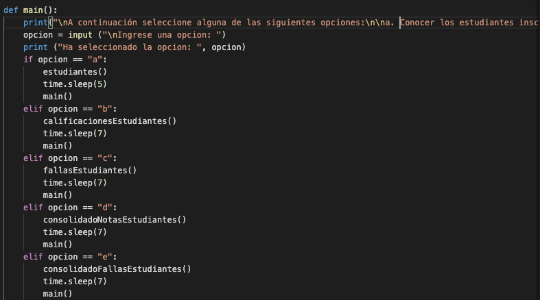
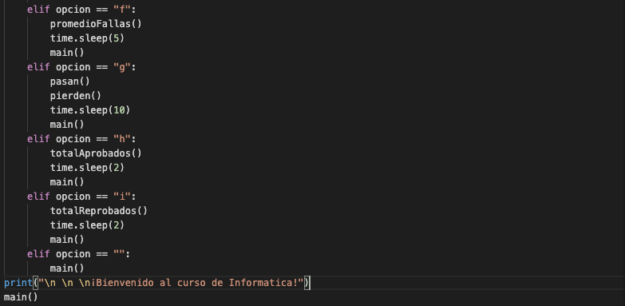

**Universidad Distrital Francisco José de Caldas**

**Facultad de Ingeniería**

**Especialización en Ingeniería de Software**

**Asignatura de Informática 1**

**Docente: Alejandro Paolo Daza**

| **Nombre: Angee Paola Ballesteros Maldonado** | **Código: 20201099027** |
| --- | --- |
| **Nombre: Luigi Santiago Fajardo Toloza** | **Código:** 20201099029 |
| **Nombre: Jeisson Jair Ariza Pulido** | **Código:** 20201099026 |

**Diseño de un aplicativo para notas de una asignatura basado en reglas de negocio con Prolog**

**Requerimiento:** Se requiere desarrollar un aplicativo para validar las notas de los estudiantes y las fallas de los mismos en una asignatura, de esta manera, basados en un conjunto de reglas definidas en prolog el aplicativo determinara si el estudiante aprueba o reprueba la asignatura. La elección del lenguaje en el cual sea creada la interfaz de interpretación de estas reglas es de libre elección. La explicación de despliegue, así como la explicación de las herramientas seleccionadas debe ser clara en el README del proyecto.

**Procedimiento:** Para este proceso se utilizarán tres herramientas, la primera de estas es SWI-Prolog, esta herramienta es una implementación en código abierto del lenguaje de programación Prolog, dicho lenguaje es un lenguaje de programación lógico e interpretado usado habitualmente en el campo de la Inteligencia artificial. Por otra parte, el equipo de desarrollo decidió utilizar Python como el lenguaje en el cual se va implementar la interfaz grafica del desarrollo, por lo cual se debe tener instalado este lenguaje en la maquina a desarrollar y adicionalmente es imperativo utilizar PySwip, la cual es una librería que permite generar un puente entre Prolog y Python. Los desarrollos serán trabajados en SWI-Prolog para el lenguaje Prolog y Visual Studio Code para el desarrollo en Python.

**Desarrollo:**

Luego de instalar las herramientas requeridas y de corroborar el correcto funcionamiento de la misma, se procede a crear las reglas de la lógica del funcionamiento del aplicativo de notas.

El primer paso consiste en crear los datos que van a ser evaluados en el conjunto de reglas, para este aplicativo se 
utilizan dos listados, el primero contiene las fallas de cada estudiante durante el semestre, mientras que el segundo contiene las notas obtenidas por los estudiantes en el semestre.

**Figura [1]: Datos que ingresan al sistema de reglas.**

El siguiente paso consiste en crear los vectores que permiten consolidar los valores promedio de las asistencias y las notas obtenidas por los estudiantes del curso.

**Figura [2]: Creación de vectores para los cálculos de porcentajes y promedios.**

Ahora se procede a crear la primera regla que permite clasificar la asistencia, para dicha tarea se tienen en cuenta las siguientes reglas:

1.  Si las fallas son 0, la asistencia es completa

2.  Si las fallas se encuentran entre 1 y 4, la asistencia es suficiente.

3.  Si las fallas son 5, la asistencia se considera como una oportunidad.

4.  Si las fallas son mayores a 5, entonces el estudiante perdió por fallas.

Luego de crear las reglas para la asistencia, procedemos a clasificar a los estudiantes dependiendo de la calificación que obtienen por sus fallas.

**Figura [3]: Reglas de asistencia.**

Posteriormente se crean las reglas para clasificar a los estudiantes dependiendo de la calificación obtenida en el semestre, dichas reglas son las siguientes.

1.  Si la nota es menor a 2.5 entonces el estudiante perdió.

2.  Si la nota se encuentra entre 2.5 y 3.0, entonces el estudiante solicita una ayuda al profesor.

3.  Si la nota se encuentra entre 3.0 y 4.9, entonces el estudiante aprobó la asignatura.

4.  Si la nota es 5.0, entonces el estudiante tuvo una nota perfecta.

Ahora se procede a crear la clasificación de los estudiantes basados en la regla a la cual aplican.

**Figura [4]: Reglas de notas.**

Ahora se procede a crear las reglas basadas en la nota obtenida y las fallas de cada estudiante, para dicho calculo de la nota definitiva se combinan las reglas definidas en los procesos anteriormente mostrados.

**Figura [5]: Reglas de nota definitiva.**

Luego de crear las reglas del aplicativo se procede a crear el aplicativo que va a implementar dichas reglas, el código es el siguiente:

**Rule Engine/Motor de Reglas**

La lógica, o reglas en nuestro caso, son piezas de conocimiento que a menudo se expresan como: \"Cuando algunas condiciones se evalúan como verdaderas, entonces realice algunas tareas\". Una regla difiere de un proceso principalmente porque los procesos comerciales representan lo que hace el negocio y las reglas de negocio representan decisiones que el negocio hace. Un motor de reglas puede verse como un sofisticado intérprete de sentencias if / then. Las declaraciones if / then que se interpretan se denominan reglas.

Las entradas a un motor de reglas son un conjunto de ejecución de reglas y algunos objetos de datos. Las salidas de un motor de reglas están determinadas por las entradas y pueden incluir los objetos de datos de entrada originales con posibles modificaciones, nuevos objetos de datos y efectos secundarios como mensajes de salida enviados a un usuario especifico. De esta manera, los archivos de reglas están basados en dos conceptos básicos:

-   Reglas: declaraciones declarativas que rigen la conducta de los procesos comerciales. Una regla consiste en una condición y acciones. La condición se evalúa y, si se evalúa como verdadera, el motor de reglas inicia una o más acciones.

-   Hechos: son los datos sobre los cuales operan las reglas. En nuestro ejemplo, el dinero disponible son hechos.

Las ventajas de usar motores de reglas son las siguientes:

1.  Mayor flexibilidad: mantener sus reglas en una base de conocimiento le permite adaptar fácilmente sus decisiones cuando están cambiando.

2.  Más fácil de entender: las reglas son más fáciles de entender que el código de procedimiento, por lo que pueden usarse de manera efectiva para cerrar la brecha entre el analista de negocios y los desarrolladores.

3.  Complejidad reducida: al incorporar muchos puntos de decisión a sus códigos de procedimiento, puede convertir fácilmente su aplicación en una pesadilla. Por otro lado, las reglas pueden manejar una complejidad creciente mucho mejor porque usan una representación coherente de las reglas comerciales.

4.  Reusabilidad: mantener las reglas en un solo lugar conduce a una mayor reutilización de las reglas de su negocio. Además, el código de procedimiento tradicional a menudo impone variaciones innecesarias de las reglas básicas que, por lo tanto, son más difíciles de reutilizar en otros contextos.

También se debe tener en cuenta que, si la lógica del negocio es estática y el número de reglas de negocio es bastante simple y limitado, usar un motor de reglas puede resultar innecesario si la lógica de su negocio es estática.

